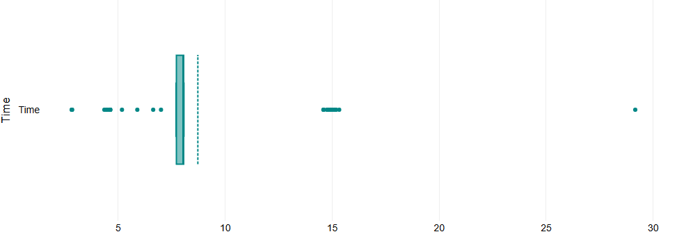
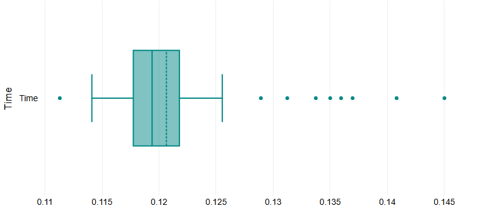

# comp3010a1
## COMP3010 Assignment 1: Message Board Server
### Part 1:

**Start the server**

- Run `python3 msg_server 8080` or `python3 msg_server 8080 -m` *(You can choose port you want)*

**GET** request
```
curl --get http://localhost:8080/text-board/2
or
curl --get http://localhost:8080/image-board/3
```
**POST** request

- The server only accepts text/plain, application/json and image/jpeg for now  (figuring out encoding/decoding for image/jpeg took longer than I thought it would)
```
curl -d '{"key1":"foo", "key2":"bar"}' -H "Content-Type: application/json" http://localhost:8080/text-board
or
curl --data-binary @Cat03.jpg -H "Content-Type: image/jpeg" -X POST http://localhost:8080/image-board/
```

### Part 2:
- Run `python3 testServer.py` to send various 100 requests
- Run `python3 runThousandTest.py` to run the testServer.py 1000 times

**Note: There is an option to run POST requests in `testServer.py` but it seems to be very inconsistent so it will run only GET requests by default*

**General idea**: Time will be added to `summaryMulti.csv` or `summarySingle.csv`. Then, I'll make boxplots all of these 2 csvs

*Single-thread*


*Multi-thread*


**Note: These boxplots only represent the distributions when they run for 100 times only. Run single-thread 100 times took too much time. It took 30min to run 123 times and I was afraid I might not have enought time to wait for it to finish*

*Observation*
- Singlethread exhibited inconsistent performance, with an average execution time of around 7 seconds. However, there were occasional spikes, reaching up to 15 seconds, and in extreme cases, even hitting 30 seconds.

- Multithreading showed significant speed improvements compared to singlethread, with an average execution time of just 0.12 seconds. Occasionally, it experienced minor slowdowns, with times ticking up to 0.145 seconds, but overall, it demonstrated extremely efficiency.